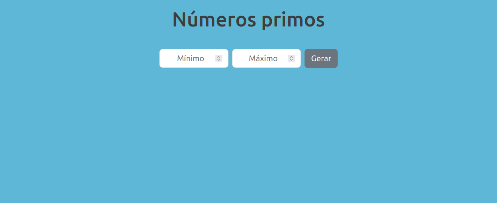
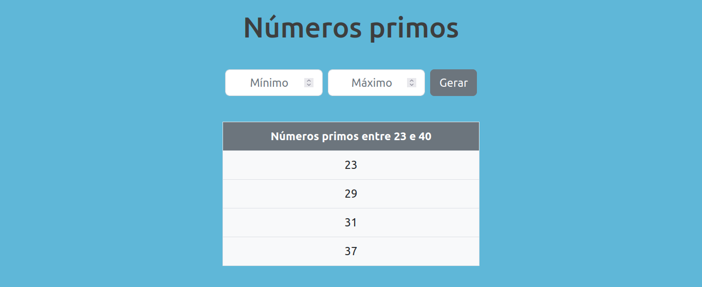
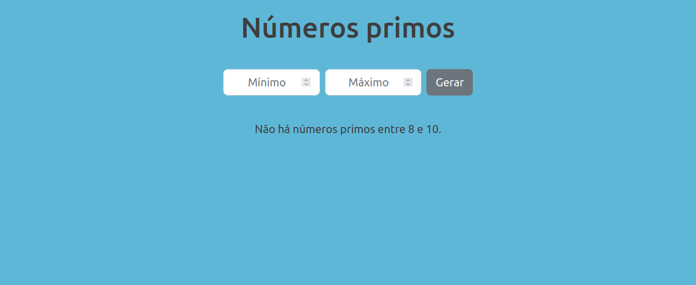

# Números primos

Esta aplicação apresenta os números primos existentes num intervalo fechado, entre [minimo, maximo]. A partir de dois números inteiros são apresentados numa tabela os primos existentes entre esses valores.

Utilizando a biblioteca React, componentes de classe renderizam a interface. São trabalhados conceitos como verificação de propTypes e manipulação de dados por meio de *state* e *props*.

##  :gear: Tecnologias

- HTML
- CSS
- JavaScript
- ReactJS
- Bootstrap

##  :art: Layout

